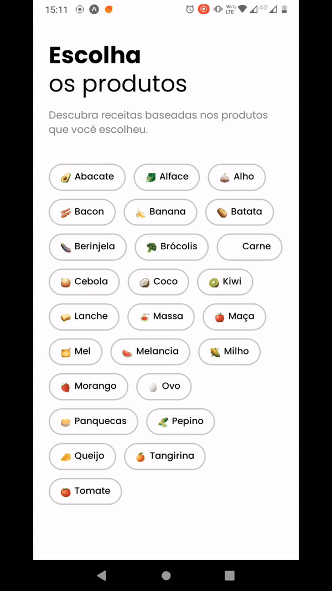

# Cook App

Projeto disponibilizado pela Rocktseat. Um Aplicativo de receitas baseado em ingredientes selecionados.

 

    
 

## Tecnologias utilizadas:

- EXPO GO:

O Expo Go é um aplicativo que permite testar e visualizar aplicativos desenvolvidos com a plataforma Expo diretamente em dispositivos móveis.

- REACT NATIVE:

O React Native é um framework de desenvolvimento de aplicativos móveis que permite criar aplicativos nativos para iOS e Android usando a linguagem de programação JavaScript e a biblioteca React.

- EXPO ROUTER:

O Expo Router é uma parte da plataforma Expo que oferece funcionalidades de roteamento e navegação entre diferentes telas para aplicativos React Native.

- TYPESCRIPT:

Adiciona tipagem ao código e permite a definição de tipos de dados.

- EXPO REANIMATED:

O Expo Reanimated é uma biblioteca utilizada em conjunto com o Expo para criar animações fluidas e interativas em aplicativos React Native.

- EXPO ICONS:

O Expo Icons é um conjunto de ícones pré-definidos que facilitam a adição de elementos visuais e de design aos aplicativos.

- SUPABASE:

Supabase é uma plataforma de desenvolvimento de aplicativos que oferece um conjunto de ferramentas para criar aplicativos web e móveis. Ele inclui um banco de dados SQL, autenticação, armazenamento de arquivos e outras funcionalidades que simplificam o processo de desenvolvimento de aplicativos modernos.

## Link para acesso ao projeto

<a href="docs/cook-app.apk">Baixe aqui a APK</a>
